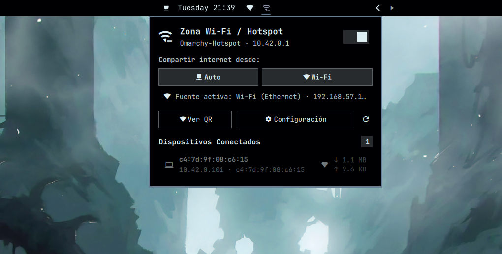

# Wi-Fi Hotspot & Repeater for Omarchy (`evcode.hotspot`)

> Fork of [CarlosEvCode/omarchy-hotspot](https://github.com/CarlosEvCode/omarchy-hotspot) with multi-radio fixes: AP-capable radio auto-detection (no hardcoded `phy0`), fallback to the real AP interface when the virtual `ap0` is rejected by the driver, `dnsmasq` dependency, and `ufw` hotspot rules in the installer.

A native status bar widget and control center for the [Omarchy](https://omarchy.org/) desktop shell. It provides access point creation, simultaneous **Wi-Fi Repeater chaining**, dynamic upstream source selection, real-time client monitoring, and instant QR code pairing.



---

## Features

- **Simultaneous Wi-Fi Repeater (STA + AP)**:
  Maintains your active Wi-Fi connection while simultaneously broadcasting a virtual access point (`ap0`). Works out of the box using standard Linux networking tools without third-party AUR daemons.

- **Dynamic Upstream Internet Selection**:
  Allows routing shared internet through **Automatic**, **Ethernet**, or **Wi-Fi**. The selector dynamically displays only active and connected interfaces.

- **Integrated QR Code Pairing**:
  Generates a high-contrast QR matrix directly within the interface for fast smartphone connection (iOS and Android), along with quick copy buttons for network credentials.

- **Client & Traffic Monitoring**:
  Displays connected stations in real time, including Hostname, IP address, MAC address, signal strength (dBm), and live traffic counters.

- **Lifecycle Management**:
  Automatically creates the virtual AP interface (`ap0`) when starting and removes it when stopped, preventing interference with regular Wi-Fi scans.

- **Omarchy Theme Integration**:
  Uses active shell theme variables (`root.bar.foreground`, `root.bar.background`, `Color.accent`, `root.bar.urgent`) to match your desktop environment seamlessly.

---

## Prerequisites

The plugin requires standard Linux networking utilities available in official Arch Linux repositories:

```bash
sudo pacman -S --needed networkmanager iw iproute2 qrencode dnsmasq
```

> `dnsmasq` is required: NetworkManager's `ipv4.method shared` fails without it (`could not start dnsmasq`).
> If `ufw` is active, the installer opens hotspot DHCP (udp/67), DNS (53) and
> forwarding automatically. Without that, clients authenticate but never receive an IP.
> Manual fallback:
>
> ```bash
> sudo ufw allow in on <AP-IFACE> to any port 67 proto udp
> sudo ufw allow in on <AP-IFACE> to any port 53
> sudo ufw route allow in on <AP-IFACE> out on <UPSTREAM-IFACE>
> ```

---

## Installation

### Via Omarchy Plugin Manager

```bash
omarchy plugin add https://github.com/elliotalien/omarchy-hotspot-fixed.git --enable
omarchy restart shell
```

> NOTE: `omarchy plugin add` only clones and enables the widget. Run `./install.sh`
> afterwards for the root helper, sudoers rule, CLI, dependencies and firewall rules.

### Manual / Local Installation

Clone the repository and run the included installation script:

```bash
git clone https://github.com/elliotalien/omarchy-hotspot-fixed.git
cd omarchy-hotspot-fixed
chmod +x install.sh
./install.sh
```

The script will automatically:
1. Validate required system dependencies.
2. Configure passwordless `sudoers.d` rules for virtual interface handling (`ap0`).
3. Deploy the backend CLI helper to `~/.local/bin/omarchy-hotspot`.
4. Install the plugin into `~/.config/omarchy/plugins/evcode.hotspot/`.
5. Reload the Omarchy Shell.

---

## Controls and Keybindings

| Action | Control |
|---|---|
| Open / Close Hotspot Panel | Left Click on bar widget |
| Quick Power Toggle | Right Click on bar widget |
| Dismiss Panel | `Esc` key or click outside |
| Toggle QR Code View | Click **Ver QR** |
| Configure Network Settings | Click **Ajustes** |

---

## CLI Helper Reference

The backend can also be operated directly from the terminal via `omarchy-hotspot`:

```bash
# Display JSON status (SSID, IP, upstream source, client list, QR matrix)
omarchy-hotspot status

# Start / Stop / Toggle Hotspot (reads PSK from stdin or saved config)
printf "%s\n" "mypassword123" | omarchy-hotspot start [SSID] [BAND] [CHANNEL] [SECURITY] [UPSTREAM]
omarchy-hotspot stop
omarchy-hotspot toggle

# List connected clients
omarchy-hotspot clients

# Persist default configuration securely (PSK passed via stdin)
printf "%s\n" "mypassword123" | omarchy-hotspot save "MyHotspot" "bg" "0" "wpa-psk" "auto"
```

---

## License

[MIT](LICENSE) © 2026 evcode
